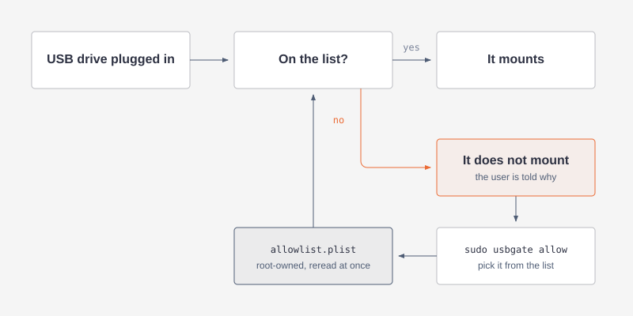

# usbgate

USB storage allowlist for macOS, in the [USBGuard](https://usbguard.github.io/)
model. A drive that is not on the list does not mount.



## Install

Requires macOS 13 and Swift 6.0 or later, which stock Xcode 16 provides.
`make` checks both first.

```sh
make install    # run as yourself, not with sudo
```

`make tools` adds swift-format, swiftlint and semgrep, used by `make check`.

## Use

```
$ usbgate rejected

  [!] 1  TransMemory         30de:6545/A1B2C3D4E5F60718
        2m ago x3 - not in allowlist
  [!] 2  USB3.0 Card Reader  05e3:0749/0000000012AB
        5h ago - not in allowlist

  cannot be authorised
  [-]    Samsung PSSD T7     pci-express
        12m ago x2 - pci-express storage is not permitted

$ sudo usbgate allow
  allow which? [1-2] enter = 1

  [+] authorised TransMemory  30de:6545/A1B2C3D4E5F60718
  [+] mounted TransMemory
```

The daemon applies the change immediately. No restart, no reload.

## Commands

```
rejected [n|all]    what was refused, 10 newest by default
allow               authorise one of them, and mount it
dismiss             drop one from the list

allow all           authorise every attached drive, after confirming
revoke              remove one from the allowlist, and unmount it
status              what is authorised, and what is plugged in
other on|off        allow or refuse non-USB external storage
watch               stream decisions
log [since]         past decisions, 7d by default
version
```

`allow`, `revoke`, `dismiss` and `other` need sudo.

## What it gates

| Storage | Default | Control |
|---|---|---|
| USB | refused unless listed | `allow` / `revoke` |
| Thunderbolt, PCIe, FireWire, SD, eSATA | refused | `other on\|off` |
| Internal disk, disk image, network | allowed | never touched |

Matched on vendor, product and serial together, no wildcards. A drive publishing
any interface class beyond `mass-storage` is refused even if its serial is listed:
[USBGuard](https://usbguard.github.io/)'s `with-interface` rule.

## The allowlist file

Everything above is stored in one file, `/var/db/usbgate/allowlist.plist`. The
commands edit it for you; you can also edit it by hand.

```xml
<dict>
    <key>AllowedDevices</key>
    <array>
        <dict>
            <key>Label</key><string>TransMemory</string>
            <key>VendorID</key><string>0x30de</string>
            <key>ProductID</key><string>0x6545</string>
            <key>SerialNumber</key><string>A1B2C3D4E5F60718</string>
        </dict>
    </array>
    <key>AllowedInterfaceClasses</key>
    <array><string>mass-storage</string></array>
    <key>AllowOtherStorage</key><false/>
    <key>Message</key>
    <string>This drive is not authorised. Contact IT support.</string>
</dict>
```

`Message` is the only text a user ever sees, in the mount-failure dialog and in
the notification. Replace it with your own wording and a way to reach someone.

The file must be `root:wheel` and writable by nobody else, or it is ignored, and
an ignored or missing file refuses every drive.

## Licence

MIT. The policy model follows [USBGuard](https://usbguard.github.io/); no USBGuard
code is used.
